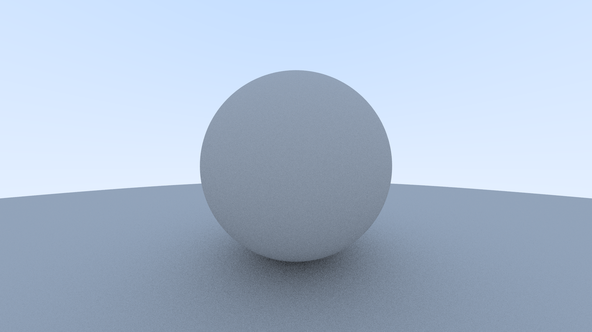
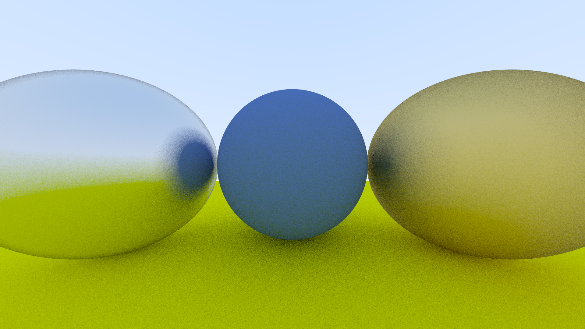

# LeyteRay

## v0.4
- 实现了基础材质模型，包括 Lambertian 反射、金属反射和 Fuzz Reflection。

[//]: # (## v0.3)

[//]: # (- 在 v0.2 的基础上重构了代码，增加了 `Camera` 类，将原来主函数中管理相机的代码移动到 `Camera` 类中。)

[//]: # (- 用多重采样实现了 `Anti-aliasing`。)

[//]: # (- 实现了一个简易的 TimeProfiler 对渲染的时间长度进行监测。)

[//]: # (- 实现了 Diffuse 材质，采用了Lambertian反射模型，并对结果进行 Gamma 校正)