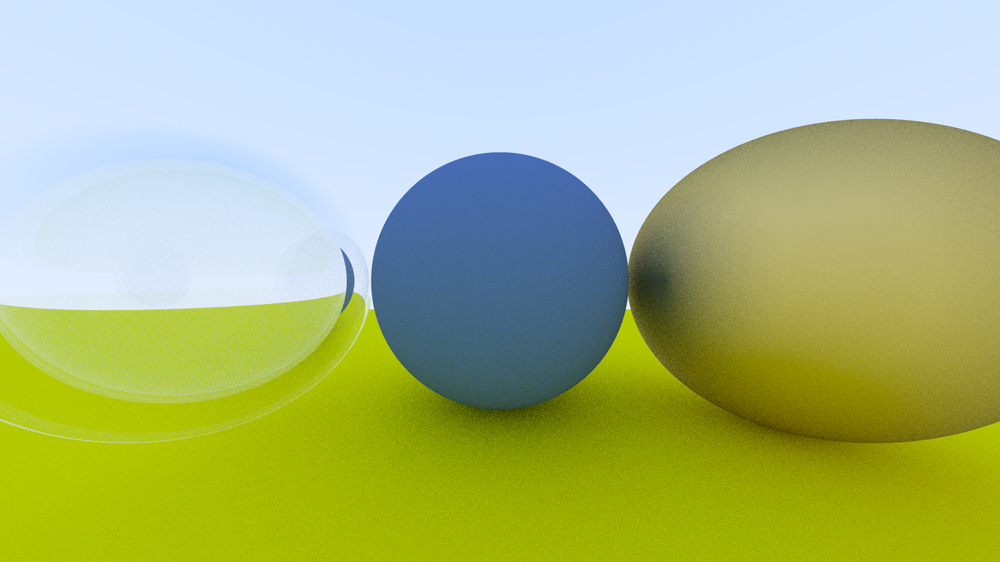
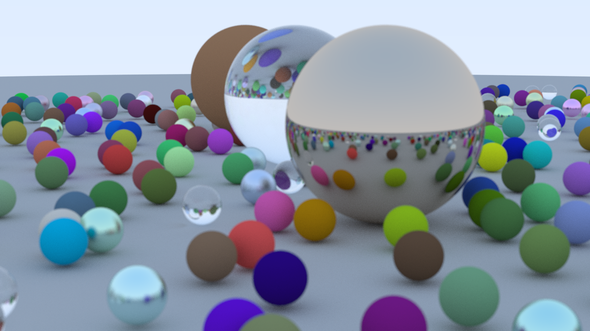

# LeyteRay

## v0.5
- 实现了电介质材质；
- 利用Schlick Approximation实现了菲涅尔效应的近似；对全反射现象进行了处理；
- 对相机进行了修改，增加了相机位置的可配置化，构建了相机坐标系；增加了景深的效果；



### 截止到v0.5版本，最终效果图如下：

渲染场景代码：
```cpp
void finalRneder1() {
    TimerProfile timer;
    HittableList world;

    auto ground_material = make_shared<Lambertian>(Color(0.5, 0.5, 0.5));
    world.add(make_shared<Sphere>(Point3(0,-1000,0), 1000, ground_material));

    for (int a = -11; a < 11; a++) {
        for (int b = -11; b < 11; b++) {
            auto choose_mat = randomDouble();
            Point3 center(a + 0.9 * randomDouble(), 0.2, b + 0.9 * randomDouble());

            if ((center - Point3(4, 0.2, 0)).length() > 0.9) {
                shared_ptr<Material> sphere_material;

                if (choose_mat < 0.8) {
                    // diffuse
                    auto albedo = Color::random() * Color::random();
                    sphere_material = make_shared<Lambertian>(albedo);
                    world.add(make_shared<Sphere>(center, 0.2, sphere_material));
                } else if (choose_mat < 0.95) {
                    // metal
                    auto albedo = Color::random(0.5, 1);
                    auto fuzz = randomDouble(0, 0.5);
                    sphere_material = make_shared<Metal>(albedo, fuzz);
                    world.add(make_shared<Sphere>(center, 0.2, sphere_material));
                } else {
                    // glass
                    sphere_material = make_shared<Dielectric>(1.5);
                    world.add(make_shared<Sphere>(center, 0.2, sphere_material));
                }
            }
        }
    }

    auto material1 = make_shared<Dielectric>(1.5);
    world.add(make_shared<Sphere>(Point3(0, 1, 0), 1.0, material1));

    auto material2 = make_shared<Lambertian>(Color(0.4, 0.2, 0.1));
    world.add(make_shared<Sphere>(Point3(-4, 1, 0), 1.0, material2));

    auto material3 = make_shared<Metal>(Color(0.7, 0.6, 0.5), 0.0);
    world.add(make_shared<Sphere>(Point3(4, 1, 0), 1.0, material3));

    Camera cam;

    cam.aspect_ratio      = 16.0 / 9.0;
    cam.image_width       = 1200;
    cam.samples_per_pixel = 256;
    cam.max_depth         = 50;

    cam.fov     = 20;
    cam.lookfrom = Point3(13,2,3);
    cam.lookat   = Point3(0,0,0);
    cam.vup      = Vec3(0,1,0);

    cam.defocus_angle = 0.15;
    cam.focus_distance = 10.0;

    timer.start();
    cam.render(world);
    timer.end();
}
```

[//]: # (## v0.4)

[//]: # (- 实现了基础材质模型，包括 Lambertian 反射、金属反射和 Fuzz Reflection。)

[//]: # (![image5.png]&#40;result/image5.png&#41;)

[//]: # (![image6.png]&#40;result/image6.png&#41;)

[//]: # (## v0.3)

[//]: # (- 在 v0.2 的基础上重构了代码，增加了 `Camera` 类，将原来主函数中管理相机的代码移动到 `Camera` 类中。)

[//]: # (- 用多重采样实现了 `Anti-aliasing`。)

[//]: # (- 实现了一个简易的 TimeProfiler 对渲染的时间长度进行监测。)

[//]: # (- 实现了 Diffuse 材质，采用了Lambertian反射模型，并对结果进行 Gamma 校正)